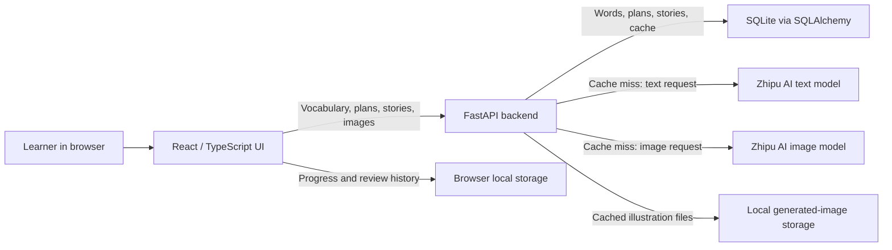
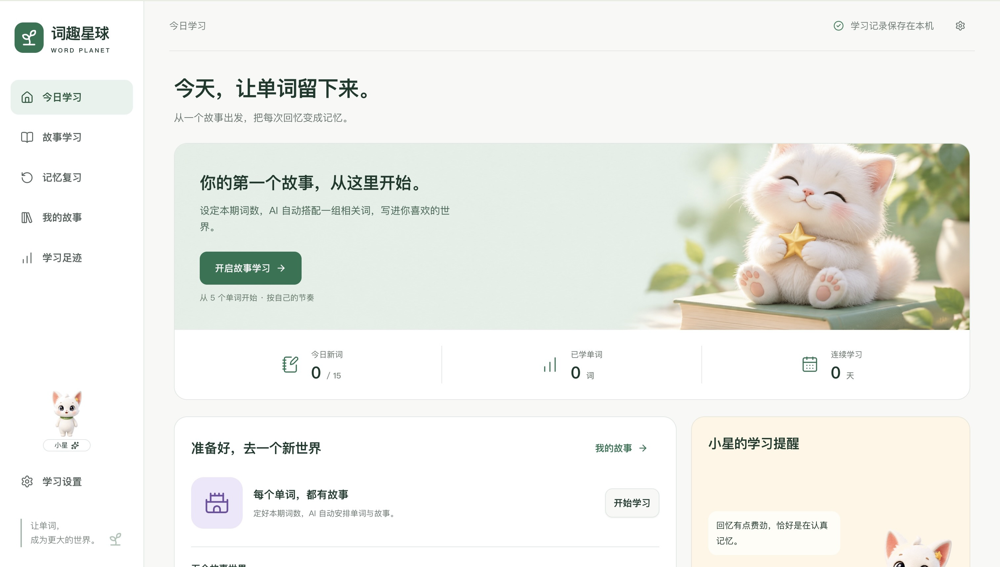
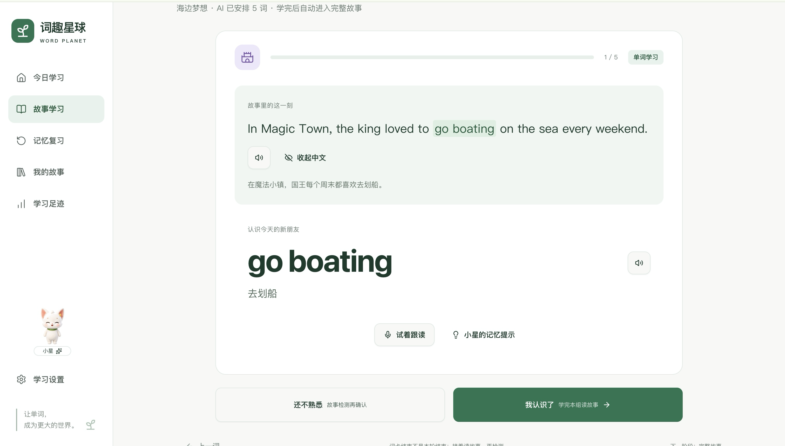
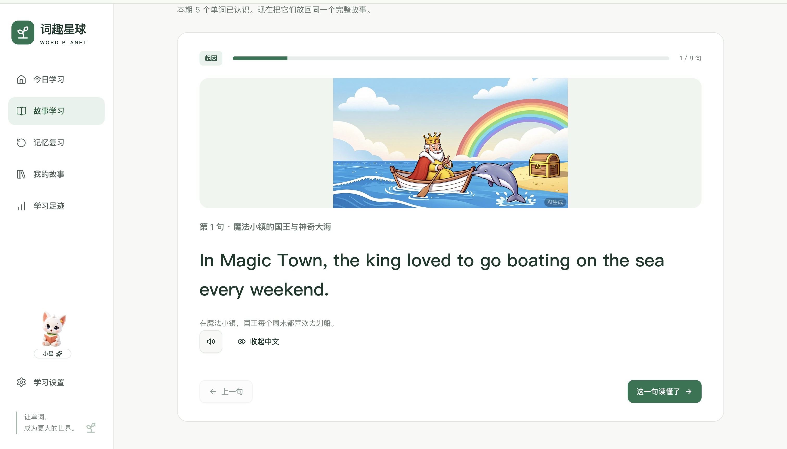
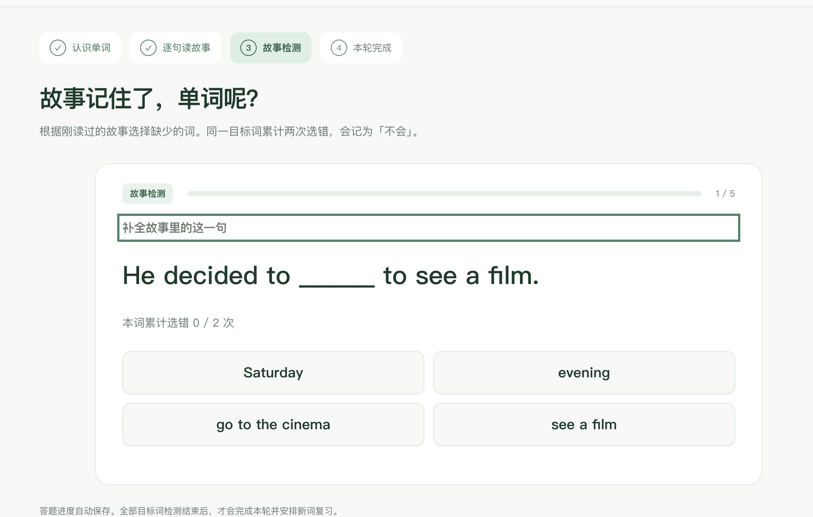

# Word Planet — AI Vocabulary Learning

Word Planet (词趣星球) is a team-built web prototype for English vocabulary learning. It is designed around upper-primary learners in China: students encounter grade-level words in a connected story, check their understanding, and return to words when review is due. This repository is a portfolio presentation; it does not contain the application's source code or learner data.

## Project Overview

The current prototype combines a React learning interface with a FastAPI service for vocabulary and AI-generated content. Learners choose a grade, a story world, and the number of words for a round. The application prepares a related group of words, a bilingual story, a story illustration, a short comprehension check, and subsequent review activities.

## Background and Motivation

While working in educational consulting, I met students who struggled to retain English vocabulary through isolated memorization. I wanted to explore whether software and AI could help them meet words in a meaningful context, then revisit those words at useful intervals. This project gave our team a way to test that idea in a working prototype.

## Main Features

- **Connected vocabulary rounds:** For grades 4–6, the learner selects a theme and a round size of 1–12 words. The backend asks AI to choose related words from the available, not-yet-learned vocabulary, then validates the selection against the database.
- **Bilingual story learning:** The backend generates a complete story containing the target words. Learners first view word cards with meanings and story sentences, then read the full story sentence by sentence with optional Chinese translation and audio playback.
- **AI illustrations:** The story view can request an illustration based on the saved story. The interface offers a retry if image generation fails while keeping the text available.
- **Story check:** A fill-in-the-blank multiple-choice activity asks learners to choose each missing target word. Two wrong selections for the same word mark it as needing more practice.
- **Review:** After the whole round is checked, new words enter a date-based review schedule. Review supports recall and spelling in the original story sentence; hints and same-day practice do not count as independent, cross-day mastery evidence.
- **Local continuity:** The browser saves round progress, stories, review history, and pending plans in local storage, so a learner can resume on the same browser.

These are implemented prototype features. They are not a claim of production readiness or measured learning effectiveness.

## Learning Workflow

1. Choose grade, story world, and words per round. AI proposes a connected set from the grade vocabulary; the backend checks count, uniqueness, and vocabulary membership.
2. Generate a complete story for that fixed plan. Study each word with its stored Chinese meaning and a sentence from the story.
3. Read the story in order. An illustration may appear alongside it; the text remains usable if the image is unavailable.
4. Complete the missing-word checks. The browser records the answers and adds new words to review only when all target words have been checked.
5. Return for due review using meaning recall or spelling in context. The local schedule changes with the learner's responses.

## Technology Stack

| Layer | Technologies verified in the project |
| --- | --- |
| Frontend | React, TypeScript, Vite, Tailwind CSS, Radix UI |
| Backend | Python, FastAPI, SQLAlchemy, Pydantic |
| Storage | SQLite for vocabulary, plans, generated stories, and cached AI results; browser local storage for learner progress |
| AI services | Zhipu AI `glm-4` for word grouping and story text; `cogview-4-250304` for illustrations |
| Design and collaboration | Figma for interface design; GitHub for team version control |

## System Architecture

The server owns the AI requests and their credentials. The browser does not store the API key. The diagram describes the local prototype; it does not imply cloud accounts, multi-device synchronization, or a deployed production service.

## My Personal Contributions

My contributions, as described from my role in the team, were:

- Participating in the initial interface design in Figma.
- Designing and implementing the database needed by the backend.
- Working on integration between the application and AI service APIs.
- Proposing reuse of previously generated AI content, and helping shape the database-backed caching approach.
- Considering API usage, waiting time, and the user experience when generation is slow or unavailable.

The application, including its frontend and backend, was developed collaboratively. These bullets do not assign sole authorship of either part to me.

## Technical Challenges and Solutions

**Keeping generated content consistent across a round.** The current flow stores a selected word plan and uses its `plan_id` when requesting the story. A pending plan is also retained in the browser, so retrying story preparation can use the same selected words. Story generation validates target-word coverage and the story's beginning, development, and ending before saving it.

**Avoiding repeated AI work.** The backend checks for saved plans and complete stories before generating them again. The story cache is keyed by grade, theme, a versioned ordered word set, and the plan's story brief; a cache hit returns the stored story. The illustration endpoint hashes its model, theme, and story or scene text to find a local image before requesting a new one. An older single-sentence endpoint also has its own database cache keyed by grade, theme, word, and previous story. These mechanisms are intended to avoid duplicate provider calls; no measured cost or latency reduction is claimed.

**Separating content from learner progress.** SQLite holds authoritative vocabulary meanings and generated content, while the browser holds the learner's current position and review state. The frontend calls backend endpoints for content but can continue displaying saved progress in the same browser. This is a local prototype design, not an account or cloud-sync system.

**Handling unavailable illustrations.** The story view keeps the generated text readable when an image request fails and offers a retry. Image caching currently uses a lock suited to a single local server process; public deployment would need stronger coordination and access controls.

## Testing and Development Status

The repository contains backend `pytest` tests for vocabulary routes, story generation, plans, sessions, illustrations, and caching. It also contains frontend state and review tests, plus browser regression scripts. The backend tests use an in-memory SQLite database and mocked AI responses; this is different from validating real provider output or a complete user journey.

On 4 October 2026, the current backend suite completed with **105 passing tests** and one dependency deprecation warning. Frontend dependencies were not available locally for a fresh test or build run, so no current frontend pass count is claimed. Earlier internal development notes report local browser checks, but the screenshots below do not verify the present build end to end.

The project is a working local prototype under development. Further checks are needed for real microphone use, generated-content quality across a broader vocabulary, and deployment security. No public production deployment, account-based storage, or measured learning outcome is claimed.

## Project Screenshots

Screenshots supplied for this portfolio show local prototype screens. They contain example learning content, not real student records.

| Home | Vocabulary in context |
| --- | --- |
|  |  |

| Story reading | Story check |
| --- | --- |
|  |  |

The fourth screenshot shows the story check, not the later due-review screen. A dedicated due-review screenshot has not been included.

## What I Learned

This project helped me learn unfamiliar development tools while connecting technical decisions to a learner's actual needs. Working with the team improved my understanding of frontend–backend communication, database design, AI integration, and the practical trade-offs among performance, maintainability, and user experience.

## Future Improvements

Potential next steps include real-user evaluation of whether stories help vocabulary retention, broader manual review of generated English and translations, stronger controls on AI usage, and account-based synchronization across devices. These are future improvements, not completed features.

## Repository Notice

This repository is maintained for portfolio and recruitment purposes. The original application was developed collaboratively as a team project. The full source code and internal resources are not publicly available.
